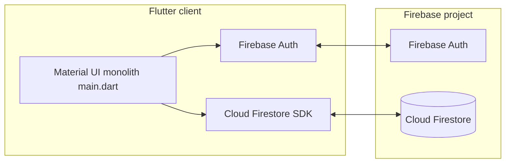
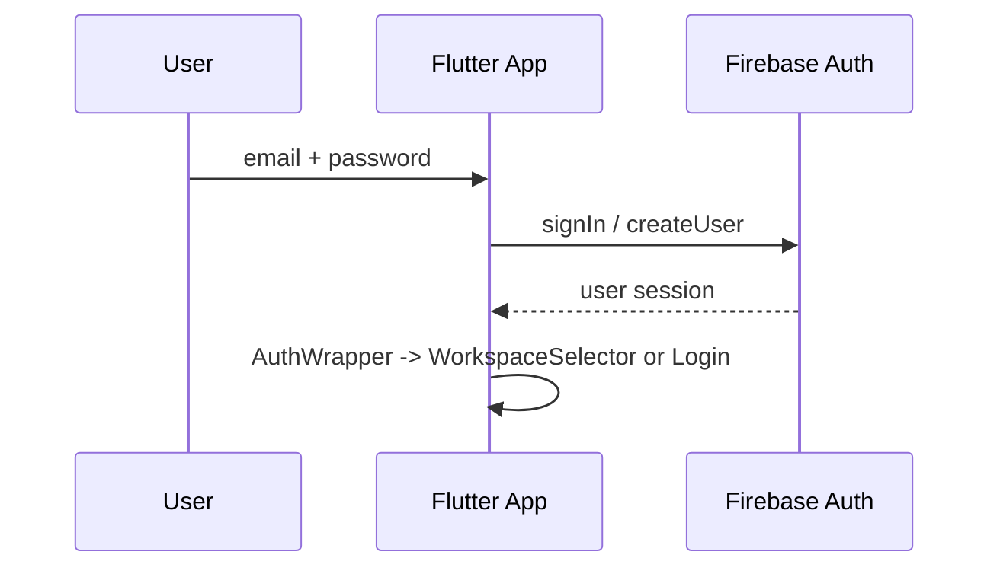
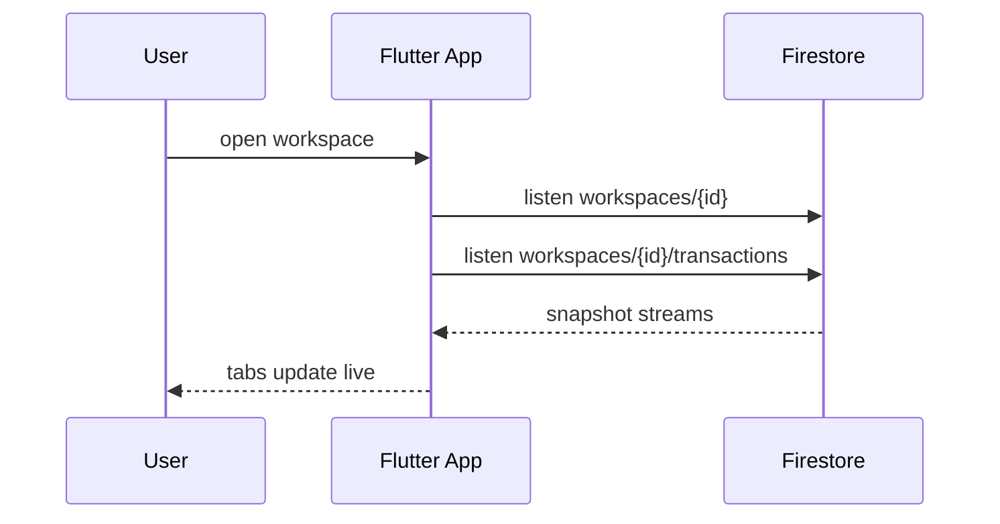

# A0 — Architecture and data model

**Audience:** engineers + PM.  
**Status:** As-built from code inspection (`lib/main.dart`) — not aspirational.

---

## 1. Logical architecture (as-built)

**Characteristics:**

- **Thin client, thick UI:** all reads/writes initiated from widgets.  
- **No** dedicated service/repository layer, **no** domain models folder, **no** dependency injection in current layout.  
- **No** Cloud Functions in repo — any server logic would be outside this snapshot.

---

## 2. Firestore collections (observed)

### Collection: `workspaces` (document per household)

**Document fields (from create + runtime reads):**

| Field | Type (logical) | Notes |
|-------|----------------|--------|
| `name` | string | Display name |
| `members` | array of string (email) | Used in query `arrayContains` |
| `billingDay` | int | Day of month that starts a “cycle” |
| `customCategories` | array of string | Category names; defaults seeded on create |
| `targets` | map string → number | Per-category target amounts (ILS implied in UI) |

**Subcollection:** `workspaces/{workspaceId}/transactions`

**Transaction fields (from writes / reads):**

| Field | Type | Notes |
|-------|------|--------|
| `title` | string | Description; installments append `(k/n)` |
| `amount` | number | Per-installment share when split |
| `isExpense` | bool | Expense vs income |
| `category` | string | Must align with workspace categories |
| `date` | timestamp | Used for cycle filtering and installment dating |
| `groupId` | string (optional) | Present for installment series |

---

## 3. Key flows (sequence — simplified)

### 3.1 Authentication

### 3.2 Workspace selection and transaction stream

---

## 4. Billing cycle logic (code behavior, summarized)

- `billingDay` on workspace defines cycle boundaries.  
- `cycleStart` / `cycleEnd` computed in UI relative to “today”.  
- Expense tab filters transactions whose `date` falls in `[cycleStart, cycleEnd)` (with small boundary adjustment in code).  

**Implication:** timezone and “month rollover” edge cases should be tested explicitly in M3/M4 hardening.

---

## 5. Target end-state architecture (recommendation only — not A0 commitment)

For maintainability as grocery + EN/HE land:

- **Layering:** `data/` (Firestore repositories), `domain/` (models + use cases), `ui/` (screens/widgets).  
- **Security:** rules co-located in repo (`firestore.rules`) with deploy script or CI step.  
- **Optional:** Cloud Functions for invites, aggregation, or sensitive operations — only if client-only model becomes insufficient.

This section is guidance for **M1+**; it does not change the “as-built” description above.
